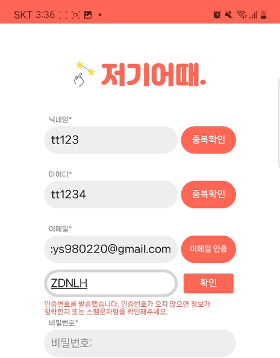
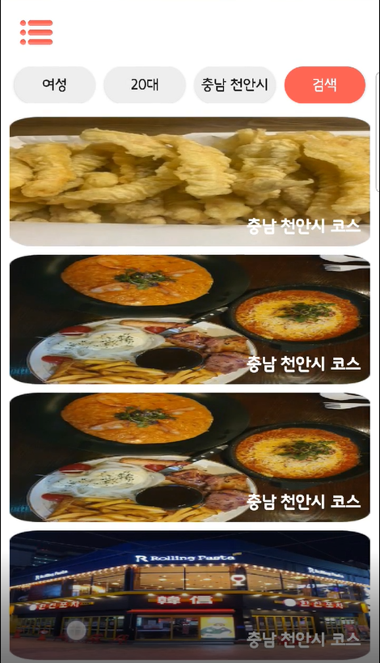
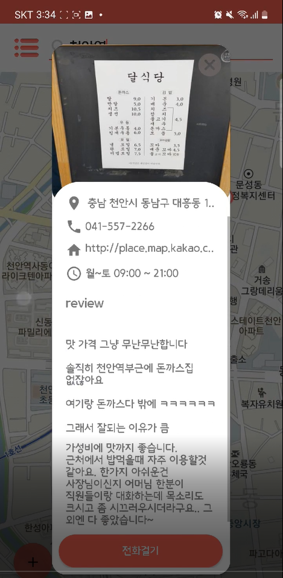
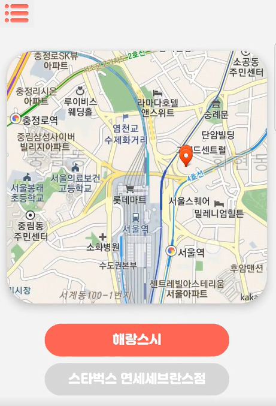

# 식당 카페 코스 연계 서비스

 
 
 
       
            

## **서비스 소개**
**HowAbout**은 식당-카페 코스를 빠르게 선택할 수 있도록 제공하는 서비스 입니다   
howabout을 통하여 식당-카페 코스를 각 지역별로 확인 하거나 추가하여 관리할 수 있습니다   
또한 해당 가게의 리뷰, 평점을 확인하여

## **역할**

- 팀장
- 구현 내용 :   
Selenium을 이용한 리뷰,사진 크롤링    
JWT와 security를 이용한 보안 방식 구현  
JavaMailSender를 이용한 본인인증    
코스관리

## 🧑🏻‍💻개발자
| 이름 | 역활 | 이메일 |
| --- | --- | --- |
| 👩🏻 이현정 | Server/App | 20191233@vision.hoseo.edu |
| 👨🏻 최용수 | Server | cys980220@gmail.com |
| 👩🏻 이수빈 | App | lsjdltnqls1110@naver.com |
| 👩🏻 전호연 | Web | 20181261@vision.hoseo.edu |
| 👨🏻 이종환  | Web | jjonghlee98@gmail.com |

**느낀 점**

- 개발의 방향성과 작업 설계의 중요성을 생각하게 되었으며, 소통의 중요성이 프로젝트에 얼마나 큰 도움이 되는지를 알게 되었습니다.

**시기**

- 프로젝트 진행 기간 (ex. 2022.7 ~ 2023.11`) .

**서비스 화면**

<table style="border: 2px; text-align:center;">
  <tr style="text-align:center;">
    <td> 메인화면 </td>
    <td> 회원가입&이메일인증 </td>
    <td> 인기코스검색 </td>
  </tr>
  <tr>
    <td>
      
    </td>
    <td>
      
    </td>
    <td> 
      
    </td>
  </tr>
</table>

<table style="border: 2px; text-align:center;">
  <tr style="text-align:center;">
    <td> 리뷰 </td>
    <td> 가게정보 </td>
  </tr>
  <tr>
    <td>
      
    </td>
    <td>
      
    </td>

  </tr>
</table>
