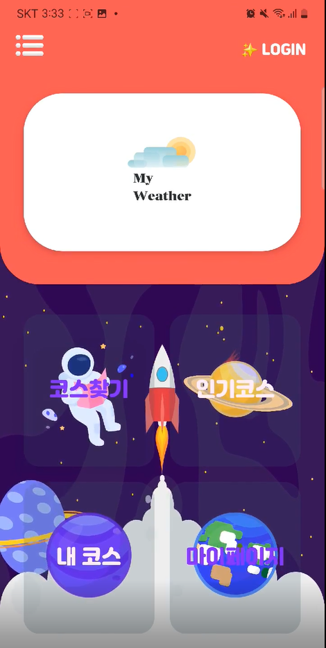

# 식당 카페 코스 연계 서비스

  
       
## **서비스 소개**
**HowAbout**은 식당-카페 코스를 빠르게 선택할 수 있도록 제공하는 서비스 입니다   
howabout을 통하여 식당-카페 코스를 각 지역별로 확인 하거나 추가하여 관리할 수 있습니다   
또한 가게에 대하여 평점이나 리뷰등 추가 정보를 확인 할 수 있습니다.

 

## 💡 주요 기능

|           기능           | 내용                                                                                                                                                                  |
| :----------------------: | :-------------------------------------------------------------------------------------------------------------------------------------------------------------------- |
|    실시간 라이브 방송    | 경매와 역경매 글을 작성하고, 예정된 라이브 시간이 되면 실시간 라이브 서비스를 통해 자신의 물건을 판매, 구매 할 수 있습니다. 라이브 방송 중 채팅 또한 가능합니다.      |
|     실시간 1:1 채팅      | 즉시 구매나 낙찰을 통해 거래가 확정되면 1:1 채팅방이 생성되고 1:1 채팅을 통해 상대방과 대화할 수 있습니다.                                                            |
|       알림 서비스        | 관심있는 거래를 등록하고, 해당 거래의 라이브 방송 전 알림을 받을 수 있습니다. 또한 낙찰 및 상위입찰 발생 시에도 알림을 받을 수 있습니다.                              |
|       소셜 로그인        | 사용자는 네이버, 카카오 소셜 로그인을 통해 서비스에 가입할 수 있습니다.                                                                                               |
|           결제           | IamPort 결제 api를 활용하여 카카오페이 QR코드를 통해 사용자는 모의 포인트 충전을 진행할 수 있습니다.                                                                  |
|       경매글 조회        | 실시간 핫 경매, 마감 임박, 진행 예정 경매, 라이브 진행 중인 경매 등 인기 있는 경매들을 메인 화면에서 조회할 수 있습니다.                                              |
|        상세 조회         | 물건의 상세 정보를 조회할 수 있으며 라이브를 진행한 물품이라면 녹화영상, 타임 스탬프, STT를 적용한 라이브 요약본을 추가적으로 확인할 수 있습니다.                     |
| 카테고리 별 조회 및 검색 | 여러 사용자가 작성한 경매 및 역경매 글에 대해 다양한 필터를 제공하여 원하는 물품을 조회 할 수 있습니다. (카테고리별, 지역별, 경매시작전, 경매진행중, 라이브진행중 등) |
|       신뢰도 지표        | 사용자의 서비스 이용 내역에 따라 신뢰도 지표를 계산하여 거래 과정에서 서로의 신뢰도를 파악할 수 있는 기능을 제공합니다.                                               |

**서비스 화면**

<table style="border: 2px; text-align:center;">
  <tr style="text-align:center;">
    <td> 메인화면 </td>
    <td> 회원가입&이메일인증 </td>
    <td> 인기코스검색 </td>
  </tr>
  <tr>
    <td>
      
    </td>
    <td>
      
    </td>
    <td> 
      
    </td>
  </tr>
</table>

<table style="border: 2px; text-align:center;">
  <tr style="text-align:center;">
    <td> 리뷰 </td>
    <td> 가게정보 </td>
  </tr>
  <tr>
    <td>
      
    </td>
    <td>
      
    </td>

  </tr>
</table>

## **역할**

### - 팀장
> #### 일정
### - 개발 
> ####  Selenium을 이용한 리뷰,사진 크롤링    
> #### JWT와 security를 이용한 보안 방식 구현  
> #### JavaMailSender를 이용한 본인인증    
> #### 코스관리
 

### **느낀 점**
- 개발의 방향성과 작업 설계의 중요성을 생각하게 되었으며, 소통의 중요성이 프로젝트에 얼마나 큰 도움이 되는지를 알게 되었습니다.

 

## 🗓️ 개발 기간 및 일정   
22.10.03. ~ 22.12.16  
 

## 🧑🏻‍💻개발자
| 이름 | 역활 | 이메일 |
| --- | --- | --- |
| 👩🏻 이현정 | Server/App | 20191233@vision.hoseo.edu |
| 👨🏻 최용수 | Server | cys980220@gmail.com |
| 👩🏻 이수빈 | App | lsjdltnqls1110@naver.com |
| 👩🏻 전호연 | Web | 20181261@vision.hoseo.edu |
| 👨🏻 이종환  | Web | jjonghlee98@gmail.com |

  

